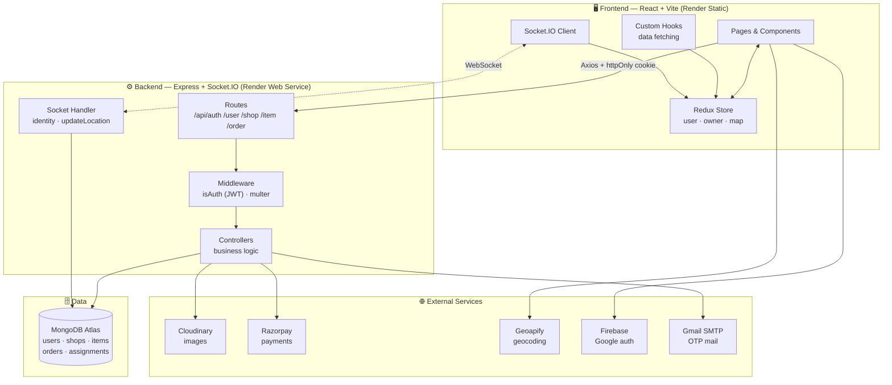
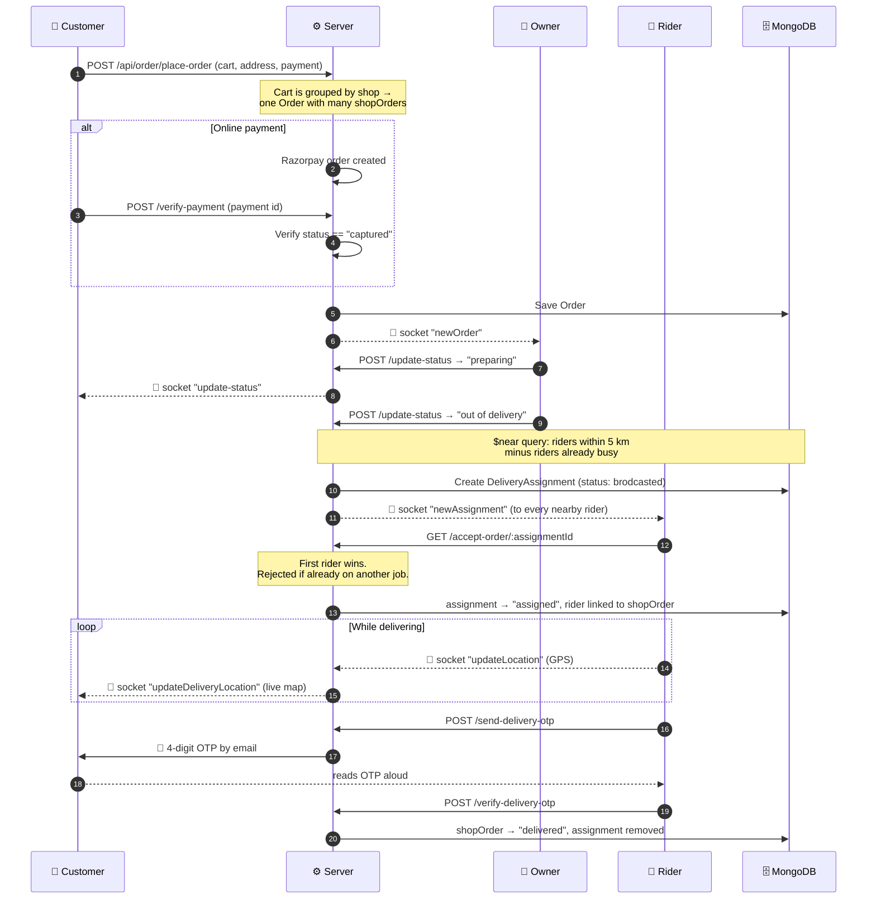
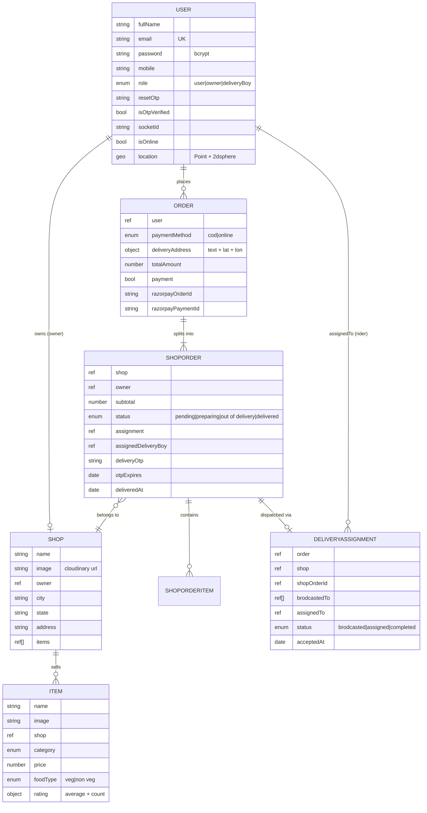

# 🧺 Local Basket

**A full-stack, multi-vendor food delivery platform built on the MERN stack — with live GPS tracking, real-time order updates, OTP-verified delivery and online payments.**

🔗 **Live Demo:** https://local-basket-frontend-wbge.onrender.com

> ⚠️ The app asks for **location permission** on load — it uses your GPS to detect your city and show nearby shops. Please allow it, otherwise the home page will look empty.

---

## 📑 Table of Contents

1. [What is Local Basket?](#-what-is-local-basket)
2. [The Three Roles](#-the-three-roles)
3. [Feature Highlights](#-feature-highlights)
4. [Tech Stack](#-tech-stack)
5. [System Architecture](#-system-architecture)
6. [How an Order Actually Flows](#-how-an-order-actually-flows)
7. [Project Structure](#-project-structure)
8. [Database Design](#-database-design)
9. [API Reference](#-api-reference)
10. [Real-Time (Socket.IO) Events](#-real-time-socketio-events)
11. [Getting Started Locally](#-getting-started-locally)
12. [Environment Variables](#-environment-variables)
13. [Deployment](#-deployment)
14. [Roadmap / Known Limitations](#-roadmap--known-limitations)

---

## 🍽 What is Local Basket?

Local Basket is a **food delivery marketplace** — think Swiggy/Zomato, but built from scratch as a learning project.

Instead of one app, it is really **three apps in one codebase**. When you log in, the app looks at your `role` and renders a completely different dashboard:

```
                    ┌──────────────────────┐
                    │   You log in ...     │
                    └──────────┬───────────┘
                               │  role = ?
          ┌────────────────────┼────────────────────┐
          ▼                    ▼                    ▼
     "user"               "owner"             "deliveryBoy"
   Browse & order      Manage shop &        Accept jobs &
   food near you       incoming orders      deliver with GPS
```

The magic ingredient is **location**. Every shop belongs to a city, every customer's city is detected from their browser GPS, and delivery partners are matched to orders using a **MongoDB geospatial query** that finds riders within 5 km of the delivery address.

---

## 👥 The Three Roles

### 🛒 Customer (`user`)
- Auto-detects your city from GPS and shows only shops in that city
- Browse by category (Pizza, Burgers, South Indian, Chinese…) or search live
- Add to cart across **multiple shops** in one order
- Pay by **Cash on Delivery** or **Razorpay** (UPI / card / netbanking)
- Watch the order status change live: `pending → preparing → out of delivery → delivered`
- Track the rider on a **live Leaflet map** while the food is on the way
- Receive an **OTP by email** that the rider must collect to complete delivery
- Rate items after ordering

### 🏪 Shop Owner (`owner`)
- Create and edit their restaurant (name, image, city, state, address)
- Full menu CRUD — add / edit / delete items with images, price, category, veg or non-veg
- Get **instant push of new orders** via Socket.IO (no refresh needed)
- Move an order through the pipeline; setting it to **"out of delivery"** automatically broadcasts a delivery job to nearby riders
- See which rider picked up the order, with their contact number

### 🛵 Delivery Partner (`deliveryBoy`)
- Streams live GPS to the server via `navigator.geolocation.watchPosition()` + Socket.IO
- Sees a list of **broadcasted jobs** near them and can accept one (first-come, first-served)
- Locked to one active delivery at a time — no double-booking
- Map view showing rider ➜ customer route
- On arrival: sends an OTP to the customer's email and verifies it to close the order
- Dashboard with **today's delivery count**, an hourly bar chart (Recharts) and earnings estimate

---

## ✨ Feature Highlights

| Area | What's implemented |
|---|---|
| **Auth** | Email + password (bcrypt hashed), Google Sign-In via Firebase, JWT in an httpOnly cookie (7-day expiry) |
| **Password reset** | 4-digit OTP emailed via Nodemailer, 5-minute expiry, 3-step flow (send → verify → reset) |
| **Location** | Browser Geolocation + **Geoapify** reverse geocoding for city/state/address |
| **Multi-vendor cart** | One order is split into per-shop sub-orders, each with its own status and rider |
| **Payments** | Razorpay order creation + server-side payment verification before marking paid |
| **Rider matching** | MongoDB `$near` 2dsphere query, 5 km radius, filters out riders already on a job |
| **Real-time** | Socket.IO for new orders, job broadcasts, status updates and live GPS |
| **Delivery proof** | OTP emailed to the customer, verified by the rider on delivery |
| **Media** | Image upload via Multer ➜ Cloudinary, local temp file cleaned up after |
| **Maps** | Leaflet + OpenStreetMap tiles with custom scooter/home markers and a route polyline |
| **Analytics** | Recharts bar chart of a rider's deliveries per hour |

---

## 🛠 Tech Stack

**Frontend**
| Tech | Why |
|---|---|
| React 19 + Vite 7 | UI and fast dev server / build |
| Redux Toolkit | Global state: user, cart, shop, map, socket |
| React Router v7 | Routing with role-based redirects |
| Tailwind CSS v4 | Styling (via `@tailwindcss/vite`) |
| Axios | HTTP client (`withCredentials` for the auth cookie) |
| Socket.IO Client | Real-time channel |
| React-Leaflet | Live tracking maps |
| Recharts | Delivery analytics |
| Firebase Auth | Google Sign-In |
| React Icons / React Spinners | Icons and loaders |

**Backend**
| Tech | Why |
|---|---|
| Node.js + Express 5 | REST API |
| MongoDB + Mongoose 8 | Database + geospatial queries |
| Socket.IO | WebSocket server |
| JWT + bcryptjs | Auth and password hashing |
| Multer + Cloudinary | Image upload pipeline |
| Nodemailer | OTP emails (Gmail SMTP) |
| Razorpay SDK | Online payments |
| cookie-parser, cors, dotenv | Plumbing |

**External services:** MongoDB Atlas · Cloudinary · Razorpay · Geoapify · Firebase · Gmail SMTP · Render (hosting)

---

## 🏗 System Architecture

### Big picture



### Request lifecycle (a normal API call)

```
Browser ──► Axios (withCredentials:true)
        ──► CORS check
        ──► cookie-parser  → reads `token` cookie
        ──► isAuth         → jwt.verify → sets req.userId
        ──► multer         → (only on image routes) saves file to /public
        ──► Controller     → Mongoose query / Cloudinary / Razorpay
        ──► res.json()  ─┐
                          └──► optionally io.to(socketId).emit(...) for real-time push
```

### Why the code is laid out this way

The backend follows a plain **layered MVC** split — each folder has exactly one job:

- `routes/` — declare URLs and stitch middleware together, nothing else
- `middlewares/` — cross-cutting concerns (auth, file upload)
- `controllers/` — all business logic
- `models/` — Mongoose schemas
- `utils/` — reusable side-effect helpers (Cloudinary, mail, JWT)
- `socket.js` — the entire real-time layer, kept out of the HTTP path

The Socket.IO instance is created in `index.js` and attached with `app.set("io", io)`, so **any controller can push a real-time event** with `req.app.get('io')` without importing globals.

On the frontend, data fetching lives in **custom hooks** (`useGetCurrentUser`, `useGetShopByCity`, `useGetMyOrders`…) that are all mounted once in `App.jsx`. They fetch, then dispatch into Redux — so components stay presentational and just read from the store.

---

## 🔄 How an Order Actually Flows

This is the heart of the app — worth reading once.



**Order status pipeline:** `pending` → `preparing` → `out of delivery` → `delivered`

**Assignment status pipeline:** `brodcasted` → `assigned` → *(deleted on delivery)*

### The rider-matching algorithm

```js
// 1. Everyone with role "deliveryBoy" inside 5 km of the delivery address
const nearBy = await User.find({
  role: "deliveryBoy",
  location: { $near: {
    $geometry: { type: "Point", coordinates: [longitude, latitude] },
    $maxDistance: 5000                       // metres
  }}
})
// 2. Drop anyone already on an active assignment
// 3. Broadcast the job to everyone left — first to accept gets it
```

This works because `User` has a **2dsphere index** on `location`, and riders keep that field fresh by emitting GPS over the socket while they are online.

---

## 📁 Project Structure

```
Local _Basket/
│
├── backend/
│   ├── index.js                    # Express + HTTP server + Socket.IO bootstrap
│   ├── socket.js                   # identity / updateLocation / disconnect handlers
│   ├── config/
│   │   └── db.js                   # Mongoose connection
│   ├── middlewares/
│   │   ├── isAuth.js               # JWT cookie → req.userId
│   │   └── multer.js               # disk storage for uploads
│   ├── models/
│   │   ├── user.model.js           # + 2dsphere geo index
│   │   ├── shop.model.js
│   │   ├── item.model.js
│   │   ├── order.model.js          # nested: order → shopOrders → shopOrderItems
│   │   └── deliveryAssignment.model.js
│   ├── controllers/
│   │   ├── auth.controllers.js     # signup/signin/signout/OTP/google
│   │   ├── user.controllers.js     # current user, location update
│   │   ├── shop.controllers.js     # create-edit, my shop, by city
│   │   ├── item.controllers.js     # CRUD, search, rating
│   │   └── order.controllers.js    # place, pay, status, assign, OTP, stats
│   ├── routes/                     # one router per domain
│   └── utils/
│       ├── cloudinary.js  ├── mail.js  └── token.js
│
└── frontend/
    ├── firebase.js                 # Firebase app + auth
    ├── src/
    │   ├── App.jsx                 # routes, guards, socket bootstrap, serverUrl
    │   ├── main.jsx                # Router + Redux providers
    │   ├── category.js             # food category list + images
    │   ├── redux/
    │   │   ├── store.js
    │   │   ├── userSlice.js        # user, cart, orders, socket, search
    │   │   ├── ownerSlice.js       # my shop
    │   │   └── mapSlice.js         # lat/lon + address
    │   ├── hooks/                  # useGetCity, useGetCurrentUser, useGetMyShop,
    │   │                           # useGetShopByCity, useGetItemsByCity,
    │   │                           # useGetMyOrders, useUpdateLocation
    │   ├── components/
    │   │   ├── UserDashboard.jsx  OwnerDashboard.jsx  DeliveryBoy.jsx
    │   │   ├── Nav.jsx  FoodCard.jsx  CategoryCard.jsx  CartItemCard.jsx
    │   │   ├── OwnerItemCard.jsx  OwnerOrderCard.jsx  UserOrderCard.jsx
    │   │   └── DeliveryBoyTracking.jsx      # Leaflet map
    │   └── pages/
    │       ├── SignUp  SignIn  ForgotPassword
    │       ├── Home  Shop  CartPage  CheckOut  OrderPlaced
    │       ├── MyOrders  TrackOrderPage
    │       └── CreateEditShop  AddItem  EditItem
    └── vite.config.js
```

---

## 🗄 Database Design



**The key design decision:** an `Order` is *not* flat. A customer can order from three shops at once, so the order embeds an array of **shopOrders** — each one has its own status, own rider, own OTP and its own delivery lifecycle. The customer sees one order; each owner sees only their slice (`shopOrders.find(o => o.owner == req.userId)`).

---

## 🔌 API Reference

Base URL: `<SERVER_URL>/api` · Auth: `token` httpOnly cookie (send `withCredentials: true`)

### 🔐 Auth — `/api/auth`
| Method | Endpoint | Auth | Description |
|---|---|:--:|---|
| POST | `/signup` | ❌ | Register (`fullName, email, password, mobile, role`) → sets cookie |
| POST | `/signin` | ❌ | Login → sets cookie |
| GET | `/signout` | ❌ | Clear cookie |
| POST | `/send-otp` | ❌ | Email a 4-digit reset OTP (5 min TTL) |
| POST | `/verify-otp` | ❌ | Verify the OTP |
| POST | `/reset-password` | ❌ | Set a new password (requires verified OTP) |
| POST | `/google-auth` | ❌ | Google Sign-In — creates the user if new |

### 👤 User — `/api/user`
| Method | Endpoint | Auth | Description |
|---|---|:--:|---|
| GET | `/current` | ✅ | Current logged-in user |
| POST | `/update-location` | ✅ | Persist `{ lat, lon }` as a GeoJSON Point |

### 🏪 Shop — `/api/shop`
| Method | Endpoint | Auth | Description |
|---|---|:--:|---|
| POST | `/create-edit` | ✅ | Create or update the caller's shop (multipart `image`) |
| GET | `/get-my` | ✅ | The caller's shop with items populated |
| GET | `/get-by-city/:city` | ✅ | All shops in a city (case-insensitive) |

### 🍔 Item — `/api/item`
| Method | Endpoint | Auth | Description |
|---|---|:--:|---|
| POST | `/add-item` | ✅ | Add a menu item (multipart `image`) |
| POST | `/edit-item/:itemId` | ✅ | Update an item |
| GET | `/get-by-id/:itemId` | ✅ | Single item |
| GET | `/delete/:itemId` | ✅ | Delete an item |
| GET | `/get-by-city/:city` | ✅ | Every item sold in a city |
| GET | `/get-by-shop/:shopId` | ✅ | Shop + its menu |
| GET | `/search-items?query=&city=` | ✅ | Search by name or category within a city |
| POST | `/rating` | ✅ | Rate an item 1–5 (updates running average) |

### 📦 Order — `/api/order`
| Method | Endpoint | Auth | Description |
|---|---|:--:|---|
| POST | `/place-order` | ✅ | Place order — splits cart by shop; returns a Razorpay order for online payments |
| POST | `/verify-payment` | ✅ | Confirm Razorpay payment, mark paid, notify owners |
| GET | `/my-orders` | ✅ | Role-aware: customers get their orders, owners get orders for their shop |
| POST | `/update-status/:orderId/:shopId` | ✅ | Owner moves the status; `"out of delivery"` triggers rider broadcast |
| GET | `/get-assignments` | ✅ | Rider: jobs broadcast to me |
| GET | `/accept-order/:assignmentId` | ✅ | Rider: accept a job (blocked if already busy) |
| GET | `/get-current-order` | ✅ | Rider: active delivery + both coordinates |
| GET | `/get-order-by-id/:orderId` | ✅ | Full order, fully populated (used by tracking) |
| POST | `/send-delivery-otp` | ✅ | Email the delivery OTP to the customer |
| POST | `/verify-delivery-otp` | ✅ | Verify OTP → mark delivered, close the assignment |
| GET | `/get-today-deliveries` | ✅ | Rider: deliveries per hour today (chart data) |

---

## ⚡ Real-Time (Socket.IO) Events

### Client ➜ Server
| Event | Payload | Meaning |
|---|---|---|
| `identity` | `{ userId }` | Bind this socket to a user; marks them online |
| `updateLocation` | `{ userId, latitude, longitude }` | Rider GPS ping — saved and re-broadcast |
| `disconnect` | — | Clears `socketId`, marks the user offline |

### Server ➜ Client
| Event | Sent to | Meaning |
|---|---|---|
| `newOrder` | Shop owner | A new order just landed for their shop |
| `newAssignment` | Nearby riders | A delivery job is up for grabs |
| `update-status` | Customer | Their order moved to the next stage |
| `updateDeliveryLocation` | Tracking clients | Rider's new coordinates for the live map |

Because every user's `socketId` is stored on their document, the server can target a specific person with `io.to(socketId).emit(...)` instead of broadcasting to everyone.

---

## 🚀 Getting Started Locally

### Prerequisites
- Node.js 18+
- MongoDB (Atlas connection string or a local instance)
- Accounts for: Cloudinary, Razorpay (test mode is fine), Geoapify, Firebase, and a Gmail **App Password**

### 1. Clone

```bash
git clone https://github.com/Patni05/MERN-project-food-delivery.git
cd "MERN-project-food-delivery"
```

### 2. Backend

```bash
cd backend
npm install
# create backend/.env — see the table below
npm run dev          # nodemon → http://localhost:8000
```

### 3. Frontend

```bash
cd ../frontend
npm install
# create frontend/.env — see the table below
npm run dev          # vite → http://localhost:5173
```

### 4. Try it out

Register **three accounts** with three different roles (`user`, `owner`, `deliveryBoy`) — ideally in three browser profiles — then:

1. As **owner**: create a shop and add a few items
2. As **user**: allow location, add items to the cart, checkout with COD
3. As **owner**: mark the order *preparing*, then *out of delivery*
4. As **deliveryBoy**: allow location, accept the job, send + verify the OTP

> 💡 The rider and the delivery address must be within **5 km** of each other, otherwise no rider will be found.

---

## 🔑 Environment Variables

**`backend/.env`**

| Variable | Description |
|---|---|
| `PORT` | Server port (e.g. `8000`) |
| `MONGODB_URL` | MongoDB connection string |
| `JWT_SECRET` | Secret for signing JWTs |
| `EMAIL` | Gmail address used to send OTPs |
| `PASS` | Gmail **App Password** (not your normal password) |
| `CLOUDINARY_CLOUD_NAME` | Cloudinary cloud name |
| `CLOUDINARY_API_KEY` | Cloudinary API key |
| `CLOUDINARY_API_SECRET` | Cloudinary API secret |
| `RAZORPAY_KEY_ID` | Razorpay key id |
| `RAZORPAY_KEY_SECRET` | Razorpay key secret |

**`frontend/.env`**

| Variable | Description |
|---|---|
| `VITE_FIREBASE_APIKEY` | Firebase Web API key (for Google Sign-In) |
| `VITE_GEOAPIKEY` | Geoapify API key (reverse geocoding + address search) |
| `VITE_RAZORPAY_KEY_ID` | Razorpay **public** key id for the checkout widget |

> 🔒 Both `.env` files are git-ignored. Never commit real keys.

### ⚙️ Pointing the frontend at the backend

The API base URL is a constant in [frontend/src/App.jsx](frontend/src/App.jsx#L28):

```js
export const serverUrl = "http://localhost:8000"
```

Change this to your deployed backend URL before building for production. The backend's CORS + Socket.IO origins are set in [backend/index.js](backend/index.js) and must be updated to match your frontend URL:

```js
app.use(cors({ origin: "http://localhost:5173", credentials: true }))
```

---

## ☁️ Deployment

The live demo runs on **Render** as two separate services:

| Service | Type | Build | Start |
|---|---|---|---|
| `local-basket-frontend` | Static Site | `npm install && npm run build` | serves `frontend/dist` |
| `local-basket-backend` | Web Service | `npm install` | `node index.js` |

**Checklist when deploying:**

1. Set every environment variable from the tables above in the Render dashboard
2. Update `serverUrl` in `App.jsx` to the deployed backend URL
3. Update the CORS origin **and** the Socket.IO CORS origin in `index.js` to the deployed frontend URL
4. Whitelist Render's outbound IPs (or `0.0.0.0/0`) in MongoDB Atlas → Network Access
5. Add the frontend domain to Firebase → Authentication → Authorized domains
6. For cross-site cookies in production, the auth cookie needs `secure: true` and `sameSite: "none"` (see `auth.controllers.js`)

> ℹ️ Render's free tier spins services down when idle — the first request after a nap can take ~30–50 seconds.

---

## 🧭 Roadmap / Known Limitations

Honest notes on where the project stands:

- **Auth cookie flags** are currently `secure: false` / `sameSite: "strict"`, which is fine locally but needs `secure: true` + `sameSite: "none"` for a cross-domain production setup
- **Ownership checks** — some item/order routes verify the JWT but not that the caller owns that specific shop resource
- **Razorpay verification** fetches the payment and checks `status === "captured"`; the stronger approach is HMAC signature verification
- **Cart is in-memory** (Redux) — it resets on refresh; persisting it to `localStorage` or the DB would be the next step
- **`serverUrl` is hardcoded** rather than read from `import.meta.env`
- Search fires on every keystroke — **debouncing** would cut a lot of requests
- No automated tests yet

---

## 👨‍💻 Author

**Bhupesh Patni** · [@Patni05](https://github.com/Patni05)

Built as a MERN mini-project exploring real-time systems, geospatial queries and multi-role application design.

---

<div align="center">

⭐ **If this project helped you learn something, consider giving it a star!** ⭐

</div>
